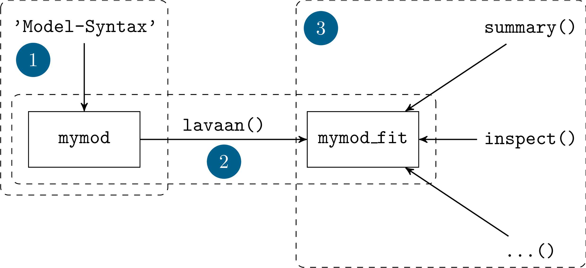

```{r setup, include = FALSE}
library(learnr)
library(gradethis)
library(shiny)
library(fontawesome)
library(lavaan)

data(fairplayer, package = 'PsyMSc1')
knitr::opts_chunk$set(exercise.checker = gradethis::grade_learnr)
```

## Einleitung

Im Verlauf dieses Seminars soll neben der Einführung in die Theorie und Hintergründe multivariater Verfahren auch eine Einführung in deren Umsetzung gegeben werden, sodass Sie in der Lage sind, diese Verfahren in Ihrem zukünftigen akademischen und beruflichen Werdegang zu benutzen. Diese Umsetzung möchten wir Ihnen mit `lavaan` zeigen - dem meistverbreiteten Paket für multivariate Verfahren wie z.B. konfirmatorische Faktorenanalyse (CFA), Pfadanalyse oder Strukturgleichungsmodellierung (SEM) in R. Allein im März 2020 wurde `lavaan` über 30 000 mal herunter geladen; es wird in allen Bereichen der psychologischen Forschung genutzt und wurde in über 6 500 sozialwissenschaftflichen Veröffentlichungen zitiert.

Dieses Tutorial bietet eine Einführung in `lavaan`. Im Zentrum stehen dabei die Grundgedanken und die typische Weise in der man in `lavaan` bei Analysen vorgeht. Um diese Ideen und Vorgehensweisen zu erkunden betrachten wir ein Beispiel aus dem letzten Semester mal aus dieser neuen Perspektive.

Wir beginnen das Tutorial aber zunächst mit einer [Auffrischung Ihrer R-Fähigkeiten](#Wiederbelebung). Auch wenn Sie im Umgang mit R sehr geübt sind, nehmen Sie sich bitte trotzdem ein paar Minuten um sich noch einmal intensiv mit den Befehlen auseinanderzusetzen, die für dieses Semester von zentraler Bedeutung sind. Sollten Sie wenig Übung im Umgang mit R haben - oder wenn Sie einfach noch einmal eine etwas detaillierte Einführung in R lesen möchten - finden Sie auf [Pandar](https://pandar.netlify.com/) die [R-Einführung aus dem Bachelorstudiengang](https://pandar.netlify.com/post/r-crash-kurs/).

Für die Durchführung dieses Tutorials benötigen Sie nichts weiter als dieses Browserfenster.

## R Grundlagen Wiederbelebung {#Wiederbelebung}

In diesem Abschnitt gucken wir uns zur Wiederholung noch einmal ein paar Grundzüge des Datenmanagements in R an, bevor wir eine multiple Regression durchführen und deren Ergebnisse genauer inspizieren.

### Beispieldatensatz

Der Datensatz, den wir in dieser Sitzung benutzen stammt aus einer Studie von Bull, Schultze & Scheithauer (2009), in der die Effektivität eines Interventionsprogramms zur Bullyingprävention bei Jugendlichen untersucht wurde. Der Datensatz liegt bereits im R-eigenen `.rda`-Format vor, sodass uns ein Import der Daten erspart bleibt. Stattdessen können wir einfach mit `load` arbeiten, um die Daten zu laden:

```{r, eval = FALSE}
load('fairplayer.rda')
```

*Hinweis: Wenn Sie mit diesen Daten in einem eigenen R-Skript Dinge ausprobieren möchten, können Sie die Daten mit `data(fairplayer, package = 'PsyMSc1')` laden.*

Verschaffen Sie sich im folgenden Fenster einen Überblick über die Daten. Wie viele und was für Variablen enthält der Datensatz? Von wie vielen Personen liegen Daten vor? Einige Befehle sind schon beispielhaft vorgegeben - Sie können aber auch andere Befehle ergänzen, um mehr Details zu erfahren!


```{r data_inspection, exercise=TRUE}
# Namen der Variablen abfragen
names(fairplayer)

# Anzahl der Zeilen und Spalten
nrow(fairplayer)
ncol(fairplayer)

# Struktur des Datensatz - Informationen zur Variablentypen
str(fairplayer)

# Datensatz ansehen
fairplayer
```

Der Datensatz, den wir hier betrachten enthält verhaltensbezogene Selbstberichte auf jeweils drei Items zur relationalen Aggression (`ra`), Empathie (`em`) und sozialen Intelligenz (`si`). Diese insgesamt 9 Indikatoren liegen zu drei Messzeitpunkten (`t1`, `t2` und `t3`) vor. Die über `str` angeforderte Struktur verrät uns außerdem, dass diese Variable allesamt integer (`int`), also ganzzahlig, sind. Über die Items hinaus sind vier weitere Variablen im Datensatz enthalten, die Personenidentifikator (`id`), die Klasse (`class`), die Interventionsgruppe (`grp`) und das Geschlecht (`sex`) der Jugendlichen kodieren.

### Datenmanagement

Eines der großen Themen in diesem Semester wird es sein, möglichst gute und zuverlässige Schätzungen für die Werte einzelner Personen auf verschiedenen psychologischen Konstrukten zu erhalten. Traditionellerweise werden dafür häufig sogenannte Skalenwerte genutzt. Diese werden meistens als Mittelwerte der Items, die ein gemeinsames Konstrukt erheben sollen, berechnet.

Für die weiteren Analysen in dieser Sitzung werden wir die Skalenwerte der relationalen Aggression, Empathie und sozialen Intelligenz zum ersten Zeitpunkt benötigen. Naheliegend wäre es, diese durch einfache Arithmetik zu bestimmen, z.B. für die relationale Aggression:

```{r, eval = FALSE}
fairplayer$rat1 <- (fairplayer$ra1t1 + fairplayer$ra2t1 + fairplayer$ra3t1) / 3
```

Von diesem Vorgehen möchten wir an dieser Stelle explizit abraten. Grund dafür ist, dass es hier nicht möglich ist den Umgang mit fehlenden Werte zu beeinflussen. Darüber hinaus wird diese Strategie mit zunehmender Anzahl von Items pro Skala sehr schreibaufwändig. Das sollten wir nicht nur aus Faulheit umgehen, sondern auch weil mehr Syntax immer auch mehr mögliche Fehlerquellen bedeutet. Stattdessen empfehlen wir mir dem `rowMeans` Befehel zu arbeiten. Z.B. für die relationale Aggression:

```{r}
fairplayer$rat1 <- rowMeans(fairplayer[, c('ra1t1', 'ra2t1', 'ra3t1')],
  na.rm = TRUE)
```

Das Argument `na.rm = TRUE` bewirkt, dass wir den Skalenwert auch dann berechnen, wenn fehlende Werte auf einzelnen Items vorliegen. Erstellen Sie die Skalenwerte für die Empathie und die soziale Intelligenz im folgenden Fenster! Mit dem "Hint" Button erhalten Sie Hinweise, durch die Sie durchblättern können. Der letzte "Hint" ist dann die vollständige Lösung.

```{r rowMeans_exer, exercise = TRUE, exercise.eval = FALSE}
# Empathie
fairplayer$emt1 <- ...

# Soziale Intelligenz
fairplayer$sit1 <- ...
```

<!-- <div id="rowMeans_exer-hint"> -->
<!-- **Tipp:** Nutzen Sie die `rowMeans`-Funktion. Sie können die Namen der einzelnen Items mit `names(fairplayer)` in Erfahrung bringen. -->
<!-- </div> -->

```{r rowMeans_exer-hint-1}
# Nutzen Sie die rowMeans-Funktion
?rowMeans
```

```{r rowMeans_exer-hint-2}
# Die Namen der Items:
names(fairplayer)
```

```{r rowMeans_exer-solution}
# Vollständige Lösung

fairplayer$emt1 <- rowMeans(fairplayer[, c('em1t1', 'em2t1', 'em3t1')],
  na.rm = TRUE)

fairplayer$sit1 <- rowMeans(fairplayer[, c('si1t1', 'si2t1', 'si3t1')],
  na.rm = TRUE)
```


```{r scales, echo = FALSE}
fairplayer$rat1 <- rowMeans(fairplayer[, c('ra1t1', 'ra2t1', 'ra3t1')],
  na.rm = TRUE)
fairplayer$emt1 <- rowMeans(fairplayer[, c('em1t1', 'em2t1', 'em3t1')],
  na.rm = TRUE)
fairplayer$sit1 <- rowMeans(fairplayer[, c('si1t1', 'si2t1', 'si3t1')],
  na.rm = TRUE)
```
```{r, echo = FALSE}
fairplayer$rat1 <- rowMeans(fairplayer[, c('ra1t1', 'ra2t1', 'ra3t1')],
  na.rm = TRUE)
fairplayer$emt1 <- rowMeans(fairplayer[, c('em1t1', 'em2t1', 'em3t1')],
  na.rm = TRUE)
fairplayer$sit1 <- rowMeans(fairplayer[, c('si1t1', 'si2t1', 'si3t1')],
  na.rm = TRUE)
```

### Deskriptivstatistik

Die drei Skalenwerte aus dem letzten Abschnitt sollten wir uns - zusammen mit ein paar anderen Variablen - mal genauer angucken, um ein Gefühl dafür zu entwickeln, wie die Lage in dieser Erhebung ist. Der Klassiker, um sich einen Überblick zu verschaffen ist die R-eigene `summary` Funktion. Bei dieser handelt es sich um eine generische Funktion, die man auf viele verschiedene Objekte in R anwenden kann. Die Aufbereitung des Ergebnisses hängt dabei immer davon ab, auf was für ein Objekt man sie angewendet hat.

Nehmen wir unsere drei Skalenwerte: bei allen handelt es sich um numerische Variablen (in R: `num`) - in R wird also davon ausgegangen, dass es Variablen mit mindestens Intervallskalenniveau sind (mehr Informationen zu Skalenniveaus in der psychologischen Methodenlehre finden Sie in [Kapitel 5 von "Statistik und Forschungsmethoden"](https://hds.hebis.de/ubffm/Record/HEB366849158)). Für solche Variablen wird in R mit `summary` eine sogenannte Fünf-Punkt-Zusammenfassung ausgegeben:

```{r}
summary(fairplayer$rat1)
```

Den Spitzfindigen unter Ihnen fällt auf, dass hier mehr als fünf Informationen ausgegeben werden. Die klassische Fünf-Punkt-Zusammenfassung besteht aus Minimum, Maximum und den drei Quartilen. In R wird zusätzlich noch das arithmetische Mittel und die Anzahl der fehlenden Werte ausgegeben.

Für nominalskalierte Variablen, wie z.B. die Gruppenzugehörigkeit `grp` sieht die Zusammenfassung ein wenig anders aus:

```{r}
summary(fairplayer$grp)
```

Weil diese Variable in R als `factor` angelegt ist, wird sie als nominalskaliert behandelt und es werden keine Statistiken berechnet, die für solche Variablen nicht aussagekräftig sind. Stattdessen wird so einfach eine Häufigkeitstabelle erzeugt.

Deskriptivstatistiken können aber auch einzeln erzeugt werden - z.B. mit `mean` für Mittelwerte. Versuchen Sie im untenstehenden Feld für den Skalenwert der relationalen Aggression die Standardabweichung mit `sd` zu bestimmen!

*Mit dem Button "Run Code" können Sie das R-Skript ausführen um Dinge auszuprobieren. Wenn Sie auf "Submit Answer" klicken, wird geprüft, ob ihr Skript richtig war.*

```{r sd_exer, exercise = TRUE, exercise.setup = "scales"}

```

```{r sd_exer-check}
fairplayer$rat1 <- rowMeans(fairplayer[, c('ra1t1', 'ra2t1', 'ra3t1')],
  na.rm = TRUE)
res <- sd(fairplayer$rat1, na.rm = TRUE)

grade_result(
  fail_if(~ is.na(.result), 'Wegen fehlender Werte kann die Standardabweichung nicht bestimmt werden. Finden Sie das geeignete Argument, dass die fehlenden Werte für die Berechnung ausschließt.'),
  fail_if(~ (!is.na(.result) & !identical(.result, res)), 'Haben Sie die korrekte Variable angesprochen?'),
  pass_if(~ identical(.result, res)),
  correct = 'Sehr gut! Der Umgang mit fehlenden Werten muss in vielen R-Funktionen explizit angesprochen werden.',
  incorrect = 'Leider falsch.',
  glue_correct = '{.correct}',
  glue_incorrect = '{.incorrect} {.message}')
```


### Kovarianzen und Korrelationen

Neben univariaten Statistiken sind für eine Veranstaltung mit dem Titel "Multivariate Verfahren" natürlich Zusammenhangsmaße von zentraler Bedeutung. Die beiden gängigsten Formen um Zusammenhänge in der Psychologie zu untersuchen sind Kovarianzen und Korrelationen. Bivariat können wir diese in R sehr einfach über `cov` bzw. `cor` anfordern:

```{r}
cov(fairplayer$rat1, fairplayer$sit1, use = 'complete')
cor(fairplayer$rat1, fairplayer$sit1, use = 'complete')
```

Mit dem Argument `use` wird der Umgang mit fehlenden Werten gesteuert - in diesem Fall sollen alle *listenweise* vollständigen Beobachtungen genutzt werden, also alle Fälle, in denen keine der beteiligten Variablen fehlt. Eine kurze Wiederholung aus Statistik I im Bachelorstudiengang: die Produkt-Moment-Korrelation ergibt sich aus $\frac{cov(x, y)}{sd(x)sd(y)}$.

Um Zusammenhänge nicht immer nur für zwei Variablen besimmen zu können, ist es auch möglich die Funktionen `cov` und `cor` auf ganze Matrizen und Datensätze anzuwenden. Nehmen wir unsere drei Skalen in einen gemeinsamen Datensatz auf:

```{r}
scales <- fairplayer[, c('rat1', 'emt1', 'sit1')]
```

Jetzt können wir die Korrelaitonsmatrix für die drei Variablen gleichzeitig bestimmen:

```{r}
cor(scales, use = 'complete')
```

Das Gleiche funktioniert natürlich auch mit der Kovarianzmatrix:

```{r}
cov(scales, use = 'complete')
```

Letztere ist für viele Analysen, die wir in diesem Semester behandeln werden zentral, weil Sie in einer Matrix (beinahe) alle relevanten Informationen über interindividuelle Unterschiede (Varianzen) und deren Zusammenhänge (Kovarianzen) enthält. Varianzen sind in der Diagonale der Matrix enthalten:

```{r}
diag(cov(scales, use = 'complete'))
```

Einen Überblick über die Befehle für Matrix-Algebra in R finden Sie auf der [Quick-R Website](https://www.statmethods.net/advstats/matrix.html).


## Wiederholung: Regression {#Regression}

Im letzten Semester haben Sie die `lm` Funktion kennengelernt um lineare Modelle in R zu berechnen. Um diese Funktion zu verwenden müssen meist zwei Argumente an `lm` weitergegeben werden:

  - `formula`: Das Modell in klassische R-Formelschreibweise
  - `data`: Der Datensatz, auf den dieses Modell angewendet werden soll
  
Die Formelschreibweise folgt in R einer einfachen Grundstruktur: `Y ~ X`. Gelesen werden kann $Y$ "vorhergesagt durch" $X$. Mehrere unabhängige Variablen, z.B. $X_1$ und $X_2$ können im Wesentlichen durch drei Operatoren verbunden sein:

  - `X1 + X2`: Für additive Modelle (nur Haupteffekte von $X_1$ und $X_2$)
  - `X1 : X2`: Für Interaktionen (nur der Interaktionseffekt $X_1 \cdot X_2$)
  - `X1 * X2`: Als Kurzschreibweise für `X1 + X2 + X1:X2`
  
Darüber hinaus können noch einige andere Operatoren genutzt werden (mehr Informationen finden Sie mit `?formula`) - z.B. kann mit `-` ein Effekt bewusst unterdrückt werden.

### Modell erstellen

Im Beispiel geht es um die drei Konstrukte relationale Aggression, soziale Intelligenz und Empathie von Jugendlichen. Da durch Interventionen soziale Intelligenz als Kompetenz gut vermittelbar ist, ist von Interesse, wie sich höhere soziale Intelligenz auf relationale Aggression auswirkt. Wichtig ist dabei, dass auch Empathie in die Gleichung einbezogen wird, weil diese konsistent ein negativer Prädiktor relationaler Aggression ist; wenn ich negative Empfindungen anderer mitfühlen kann ist es weniger wahrscheinlich, dass ich durch mein Verhalten solche negativen Empfindungen hervorrufen möchte. Die Beziehung zu sozialer Intelligenz war in der Literatur lange aber nicht so eindeutig - erst in den späten 2000er Jahren wurde die Befundlage hierzu eindeutig (aus dieser Zeit stammt der Datensatz).

Um diese Fragestellung zu bearbeiten können wir mit dem Datensatz eine multiple Regression zur Vorhersage relationaler Aggression durch Empathie und soziale Intelligenz durchführen. Erstellen Sie im folgenden Kasten ein Modell mit dem einfallsreichen Namen `mod` in dem die Ergebnisse der additiven Regression $RA_1 = b_0 + b_1EM_1 + b_2SI_1 + e$ abgelegt sind!

```{r lm_mod_exer, exercise = TRUE, exercise.setup = 'scales'}

```


```{r lm_mod_exer-solution}
mod <- lm(rat1 ~ sit1 + emt1, fairplayer)
```

```{r lm_mod, echo = FALSE}
fairplayer$rat1 <- rowMeans(fairplayer[, c('ra1t1', 'ra2t1', 'ra3t1')],
  na.rm = TRUE)
fairplayer$emt1 <- rowMeans(fairplayer[, c('em1t1', 'em2t1', 'em3t1')],
  na.rm = TRUE)
fairplayer$sit1 <- rowMeans(fairplayer[, c('si1t1', 'si2t1', 'si3t1')],
  na.rm = TRUE)
mod <- lm(rat1 ~ sit1 + emt1, fairplayer)
```
```{r, echo = FALSE}
mod <- lm(rat1 ~ sit1 + emt1, fairplayer)
```


### Regressionergebnisse

Es gibt jetzt eine Vielzahl von Möglichkeiten um die Ergebnissen des Modells zu inspizieren. Mit dem einfachen Aufruf des Modells erhalten wir zunächst nur die Regressiongewichte:

```{r}
mod
```

Wir können uns die Koeffizienten mit `coef` auch als Vektor ausgeben lassen, was den Vorteil hat, dass wir sie in anderen Funktionen weiterverwenden können. Zum Beispiel in einem Scatterplot:

```{r, fig = TRUE}
plot(fairplayer$rat1 ~ fairplayer$sit1)
abline(coef(mod)[1], coef(mod)[2])
```

Üblicherweise wird aber auch bei `lm`-Objekten der `summary`-Befehl genutzt, um die Ergebnisse genauer zu inspizieren. Nutzen Sie diesen Befehl, um sich einen Überblick zu verschaffen. Welche Regressionsgewichte sind bedeutsam von 0 verschieden? Wie groß ist der Determinationskoeffizient $R^2$?

```{r sum_lm, exercise = TRUE, exercise.setup = 'lm_mod'}

```

```{r sum_lm-solution}
summary(mod)
```

Der Abschnitt `Coefficients` enthält die relevanten Aussagen zu den Regressionsgewichten. Um uns nur diesen anzusehen, können wir das `$` benutzen um, wie bei allen R-Objekten, nur einen spezifischen Abschnitt zu betrachten.

```{r}
summary(mod)$coef
```

Die Zeilennamen dieser Tabelle (`r paste(rownames(summary(mod)$coef))`) geben an, zu welchem Prädiktor das Regressiongewicht gehört. In der Spalte `Estimate` wird das Regressionsgewicht angegeben. Hier wird also für zwei Jugendliche, die sich um eine Einheit in sozialer Intelligenz (`sit1`) unterscheiden aber das gleiche Ausmaß an Empathie (`emt1`) haben, ein Unterschied in der relationalen Aggression von `r formatC(coef(mod)[2], format = 'f', digits = 2)` Einheiten vorhergesagt. Bei gleicher Empathie führt höhere soziale Intelligenz also zu *mehr* relationaler Aggression. Die nächste Spalte `Std. Error` gibt den Standardfehler an, welcher das Ausmaß an Unsicherheit quantifiziert, das wir in der Schätzung des Populationswertes dieses Regressionsgewichts aufgrund unserer Stichprobe haben. Das Verhältnis aus Regressionsgewicht und Standardfehler ($\frac{`r formatC(coef(mod)[2], format = 'f', digits = 2)`}{`r formatC(summary(mod)$coef[2,2], format = 'f', digits = 2)`} = `r formatC(summary(mod)$coef[2,3], format = 'f', digits = 2)`$) folgt - wenn die Voraussetzungen der Regressionsanalyse halten - einer $t$-Verteilung mit $n - k - 1$ Freiheitsgraden und wird daher in der Tabelle als `t Value` geführt. Weil wir wissen, wie wahrscheinlich es unter dieser Verteilung ist einen Wert von `r formatC(summary(mod)$coef[2,3], format = 'f', digits = 2)` zu beobachten, können wir (in der letzten Spalte) einen $p$-Wert bestimmen. In diesem Fall heißt es also, dass wenn in der Population der wahre Wert dieses Regressionsgewichts 0 wäre, die Wahrscheinlichkeit in unserer Stichprobe ein Regressionsgewicht von `r formatC(coef(mod)[2], format = 'f', digits = 2)` oder extremer zu finden `r formatC(summary(mod)$coef[2,4], format = 'f', digits = 5)` ist. "Extremer" heißt hierbei, dass das Regressionsgewicht vom Betrag her größer sein müsste.

Versuchen Sie nach dem gleichen Prinzip, nach dem wir oben die Koeffiziententabelle aus der `summary` extrahiert haben, den Determinationskoeffizienten zu extrahieren!

```{r lm_rsq, exercise = TRUE, exercise.setup = 'lm_mod'}

```

```{r lm_rsq-hint-1}
# Im Englischen wird der Determinationskoeffizient häufig als "R Squared" bezeichnet
```

```{r lm_rsq-hint-2}
# Namen aller Elemente in der summary:
names(summary(mod))
```

```{r lm_rsq-solution}
# Vollständige Lösung
summary(mod)$r.squared
```

```{r lm_rsq-check}
fairplayer$rat1 <- rowMeans(fairplayer[, c('ra1t1', 'ra2t1', 'ra3t1')],
  na.rm = TRUE)
fairplayer$emt1 <- rowMeans(fairplayer[, c('em1t1', 'em2t1', 'em3t1')],
  na.rm = TRUE)
fairplayer$sit1 <- rowMeans(fairplayer[, c('si1t1', 'si2t1', 'si3t1')],
  na.rm = TRUE)
mod <- lm(rat1 ~ sit1 + emt1, fairplayer)
res1 <- summary(mod)$r.squared
res2 <- summary(mod)$adj.r.squared
grade_result(
  pass_if(~ identical(.result, res1)),
  pass_if(~ identical(.result, res2)),
  correct = 'Sehr gut! Diese Form der Extraktion bestimmter Elemente werden wir im Verlauf des Semester öfter verwenden.',
  incorrect = 'Leider falsch. Schauen Sie sich das Vorgehen bei der Koeffiziententabelle noch einmal genauer an.',
  glue_correct = '{.correct}',
  glue_incorrect = '{.incorrect}')
```


## lavaan

Alle Dinge, die wir in den bisherigen Abschnitten besprochen haben sind Wiederholung von Konzepten aus dem Bachelorstudium oder der vergangenen Semester gewesen. In diesem Semester werden wir hauptsächlich mit dem R Paket `lavaan` arbeiten. Der Name ist dabei ein Akronym für **la**tent **va**riable **an**alysis. Im Rest dieser Sitzung werden wir uns die Kerngedanken des Pakets und das grundsätzliche Vorgehen zur Modellschätzung am Beispiel der multiplen Regression ansehen. Mehr Informationen zu `lavaan` finden Sie unter [lavaan.org](http://lavaan.org/).

